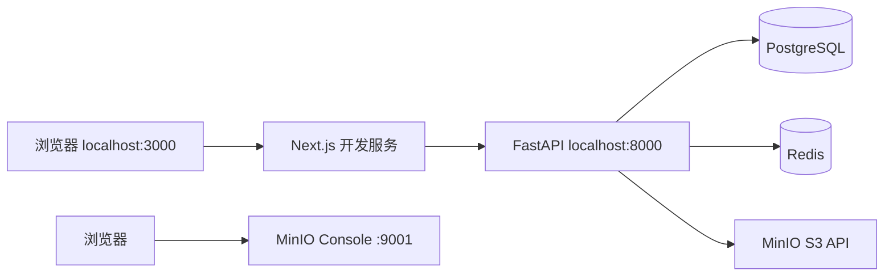
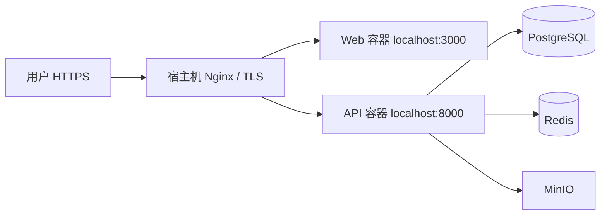

# 系统架构

更新日期：2026-10-04。按当前本地源码、数据模型、部署配置及 2026-10-04 生产发布结果校正。项目总览与已知能力边界见 [PROJECT_CONTEXT](PROJECT_CONTEXT.md) 和 [REQUIREMENTS](REQUIREMENTS.md)。

## 本地开发结构



应用服务使用本机 `npm run dev` 和 `uvicorn`，方便热重载与断点调试；`docker-compose.yml` 只启动 PostgreSQL、Redis、MinIO，证据 bucket 由 `app.bootstrap` 初始化。容器端口绑定 localhost；该文件与生产 Compose 分开。

## 技术选择

- Web：Next.js 15.5 App Router、React 19、TypeScript、独立页面与表单组件。
- API：Python ≥3.11、FastAPI、Pydantic、SQLAlchemy 2、Alembic；生产 Dockerfile 使用 Python 3.12。
- 数据：PostgreSQL 保存全部账号、组织、控制、检查、证据元数据、整改、仪表盘来源数据和审计事件。
- 文件：MinIO 的私有 bucket 保存原始文件字节；数据库行保存 bucket/key、文件名、MIME、字节数、SHA-256、上传者和业务关联。
- 缓存：Redis 保存会话 token 撤销等轻量状态；不得作为核心业务事实源。
- 鉴权：短期 JWT 通过 HttpOnly、SameSite=Lax cookie 交给浏览器；写操作验证 `Origin`；API 另为 Swagger/自动化保留 Bearer token 登录返回方式。登出撤销当前 token 标识。

## API 边界

- `/api/auth/login|logout|me`、`/api/auth/register-company`：用户登录、自助注册公司经理账号与当前身份。
- `/api/admin/registration-invitations`：系统管理员签发、查看列表和撤销一次性注册邀请码；`/{id}/code` 仅允许系统管理员取回仍有效邀请码。数据库保存 SHA-256 校验摘要及使用 AI 加密密钥保护的可选密文；历史迁移来的记录密文为空，不能还原明文。
- `/api/organizations`、`/api/organizations/{id}`、`/api/organizations/{id}/restore`、`/api/organizations/{id}/members`：公司创建、可恢复停用/恢复及成员管理。
- `/api/industry-template-catalog`、`/api/industry-templates/{template_id}`：轻量行业目录与按需加载的完整手册；`/api/industry-templates` 保留为兼容旧客户端的完整目录。`/api/organizations/{id}/industry-templates/{template_id}/apply` 将模板初始化到公司业务数据，并记录审计来源、阻止重复灌入。
- `/api/compliance-library?organization_id=…[&industry_key=…]`：返回法规索引及指定行业的流程指引；默认只生成公司当前行业指引，跨行业指引按需请求。API 对大于 1 KB 的响应启用 gzip 压缩。
- `/api/departments`、`/api/processes`、`/api/risks`、`/api/control-objectives`、`/api/controls`、`/api/rcms`：基础领域资源。
- `/api/inspections` 与 `/api/inspection-tests`：检查和检查项；检查项通过 `inspection_id` 关联检查。
- `/api/processes/{id}/configuration` 及 `template|publish`：流程设计草稿与发布版本；`/api/processes/{id}/policies`：流程制度关联。
- `/api/risk-management`、`/api/risk-templates` 及 `apply`：风险台账与模板；`/api/risks/{id}/remediation`：直接从风险创建整改事项。
- `/api/findings`、`/api/findings/{id}/issue`、`/api/issues`：发现及问题。
- `/api/issues/{id}/remediation` 及 `submit|review|retest|close` 动作：显式工作流。
- `/api/evidence`、`/api/evidence/{id}/download`：真实文件对象。
- `/api/policies`、`/api/policies/upload`、`/api/policies/{id}/download|analyses|analyze`：公司制度库、下载和单份制度的版本化 AI 审阅报告。
- `/api/policy-cross-analysis/context`、`/api/policy-cross-analyses`：读取本公司活动流程/制度关系上下文，创建并回看制度与流程交叉分析报告。
- `/api/dashboard?organization_id=…`：数据库聚合。
- `/api/ai/settings|assist|quota|quotas|quota-requests`：公司 AI 设置、助手、额度及申请；普通成员默认月额度 2,000,000 tokens，现有普通成员额度由迁移统一调整；系统管理员跳过用量上限但仍记录 Token 用量。`/api/billing/*`、`/api/admin/users/*`：账户收费状态和管理员操作。

基础领域资源的一部分通过 `main.py` 的通用资源注册函数建立，并非全部使用独立装饰器声明。

创建或变更操作在一个数据库事务中执行；带状态的并发动作锁定 Issue 行；审计事件与业务变更同事务提交。选择上游对象时先按当前组织过滤，再验证关联实体组织与流程一致。

行业流程模板由 `app/industry_templates.py` 维护，组织模型、RACI、示范制度、12 周工作计划和案例包由 `app/industry_playbooks.py` 维护，并通过公开目录 API 一起返回。新账号注册必须持有一条有效的邀请码；邀请码的锁定、标记使用与用户、公司、经理 membership 及可选行业初始化在同一数据库事务中提交。邀请码为一次性使用，系统管理员可撤销或重新查看未使用码；PostgreSQL 保存 SHA-256 校验摘要和由 `AI_ENCRYPTION_KEY` 保护的密文，不保存明文。旧记录不会自动失效，但其明文无法从历史摘要恢复。原有用户和登录路径不变。现有公司由经理单独应用行业参考模板。行业检查项默认 `not_tested`，模板只给流程、总体、样本计划、测试程序和证据建议，实际执行结果和 MinIO 对象必须由公司用户产生。阶段标签描述逐步完善的做法，不是行业成熟度统计。公开执法事实和虚构演练案例分开标识；来源司法辖区和适用边界随手册展示。

制度分析文件原件仅保存在私有 MinIO bucket；API 上传时使用 PDF/DOCX/TXT/Markdown 安全提取正文以验证可读性，正文不写入 PostgreSQL。每次调用模型前重新从 MinIO 读取文件，并把完整制度正文和最多 15 条按行业筛选的法规索引摘要发送到公司配置的 AI 服务商；必须由操作者逐次确认。AI 只接收索引摘要和官方来源 URL，不会自动打开法规页面或核验现行全文。报告只允许引用当前上下文中的法规 ID，API 用系统索引解析为固定官方链接；制度引文须与上传正文一致，否则丢弃。报告、分析人、服务商、Token 用量和审计事件保存至 PostgreSQL。

制度合规菜单分为“公司制度库”“AI 单份审阅”“制度间 AI 分析”三个工作区。两类 AI 操作均使用公司 AI 设置中当前配置的服务商/模型；当前没有多模型候选目录。交叉分析要求至少选择两份制度，可选当前活动流程（包含保存的流程草稿、草稿版本、已发布版本号及制度关联），并逐次确认将所选制度全文和流程上下文发送给服务商。服务端校验公司范围、制度 SHA-256、来源 ID 和 AI 用量；每次最多 20 份制度、100 个流程、总输入 100,000 字符。制度正文只在请求期间从 MinIO 读取；`policy_cross_analyses` 仅保存来源名称/哈希/字符数、流程配置版本/哈希、结构化报告和 Token 用量，不保存本次提交的完整正文。报告中的制度/流程证据引文须能匹配本次来源文本；报告只覆盖所选范围，流程草稿不代表实际工作流执行。

## 本地设置

`.env.example` 提供开发配置变量；本地 `.env` 忽略提交。Bootstrap 创建专用证据 bucket，并可重复执行；已有管理员密码不会被重置。本地初始化目前复用 MinIO 管理凭据作为应用凭据，不能把“已实现独立应用密钥”当作事实。迁移使用 Alembic；密钥不得写入客户端或文档。

## 目录

```text
icms/
├── apps/api/       # FastAPI、SQLAlchemy、Alembic、API 与业务测试
├── apps/web/       # Next.js App Router
├── docs/           # 需求、架构、领域、ERD、RBAC、研究
├── scripts/        # 初始化、生产部署、健康检查辅助命令
├── infrastructure/ # 生产 Nginx 配置
├── docker-compose.yml
├── compose.production.yml
├── AGENTS.md
├── .env.example
├── README.md
└── ROADMAP.md
```

应用由开发者本机安装依赖后启动；核心基础设施经 Compose 持久化到命名卷。删卷是破坏性重置，日常关闭服务用 `docker compose down`，保留卷。

## 实际模块与数据流

| 模块 | 实现位置与数据 |
|---|---|
| 导航与基础资源 | `apps/web/app/page.tsx`、`apps/api/app/main.py`；公司、成员、部门、流程等真实 API；证据库入口位于“监督整改”菜单，展示当前公司的证据元数据并通过 API 下载；文件名与业务关联受列宽约束，省略部分可悬停查看；点击证据行显示现有元数据详情侧栏，无新增 API/数据库字段 |
| 流程设计 | `ProcessConfiguration.tsx`、`process_configuration.py`；JSON 草稿与不可覆盖的发布快照 |
| 风险与控制矩阵 | `RiskManagementPage.tsx`、`RiskControlMatrixPage.tsx`、`risk_management.py`；Risk/ControlObjective/Control/RCM 及关联表 |
| 检查、发现与整改 | `InspectionDetail.tsx`、主页面与 API 动作；Inspection/Test/Finding/Issue/Plan/Submission/Review/Retest；整改详情读取现有公司成员 API 的 membership role，按启用状态、责任人、提交人、重测人列出每阶段可处理同事与邮箱，并解释当前用户权限；新建/转派时 API 校验责任人是当前公司启用成员，且其外保留两名独立处理人。此项只改应用逻辑，不新增数据表或迁移。 |
| 制度与 AI | `PolicyReviewPage.tsx`、`policy_documents.py`、`policy_review.py`、`policy_cross_analysis.py`、`ai_service.py`；PolicyDocument/Analysis/PolicyCrossAnalysis、加密配置、配额与用量 |
| 行业与法规 | 行业/法规页面与 `industry_templates.py`、`industry_playbooks.py`、`compliance_*`；本地维护的参考资料，经 API 返回或应用到公司 |
| 汇总与报告 | Dashboard API 聚合；`InternalControlReportPage.tsx` 读取业务 API，在浏览器组装 Word 和打印 PDF |
| 注册邀请码 | `RegistrationInvitation` 与 Alembic 迁移；系统管理员 API/用户管理页面生成、查看有效码、追踪和撤销新注册使用的一次性码，不影响既有账号认证 |
| AI 配额 | `AIUserQuota` 按公司/成员记录普通成员自然月额度；`20261004_0017` 将既有普通成员额度和数据库默认统一为 2,000,000 tokens；系统管理员服务端跳过额度拦截并返回不限额状态，仍记录模型实际/估算用量 |

主要关系：公司 → 部门 → 流程 → 风险/控制目标/措施 → RCM → 检查项 → Finding → Issue → 整改版本 → 复核/重测/关闭。Issue 也可直接来源于风险。Evidence 字节保存在 MinIO，元数据关联 RCM、整改草稿或提交版本；PolicyDocument 通过 ProcessPolicyLink 关联流程。

企业级目标和制度修订审批目前没有独立模型。流程配置中的审批/任务步骤仅用于设计与发布，发布不会自动启动待办、通知或业务执行引擎。新增能力须先确认领域关系，避免把配置版本与运行实例混为一体。

## 当前生产部署结构



当前仓库已具备独立 `compose.production.yml` 和 API/Web Dockerfile。生产 Compose 运行五个服务，数据库、Redis、MinIO 不发布公网端口；API/Web 仅映射到宿主机回环地址。Nginx 终止 HTTPS 并转发 Web、API 和健康检查请求；证书由 Let's Encrypt/Certbot 管理。

部署资料指定腾讯云目标 `https://contrlio.com`、源码目录 `/opt/contrlio`；入口为 `scripts/init-production-env.sh` 与 `scripts/deploy-tencent.sh`。API 容器入口执行 Alembic 迁移、Bootstrap，再启动 Uvicorn。数据服务使用命名卷；生产环境文件独立于本地，发布不自动复制本地数据库、MinIO 或密钥。2026-10-04 邀请码管理员查看修复发布时迁移版本为 `20261004_0015`。发布前源码及 PostgreSQL 备份在 `/root/contrlio-backups/20261004-registration-invite-visibility`；部署后 API/数据库/Redis/MinIO 健康、首页 HTTP 200，已登录系统管理员页面展示新查看入口。生产有 1 条升级前创建的待用历史码，其明文不可恢复但记录仍有效；新建邀请码使用 `AI_ENCRYPTION_KEY` 保存加密副本。普通成员 AI 月额度提升已于 2026-10-04 发布，生产迁移头为 `20261004_0017`；该发布的备份位于 `/opt/contrlio/backups/ai-quota-20261004-205132`，健康检查和首页 HTTP 200。额度数据聚合核验及认证态 AI 额度接口/UI 尚待终端重新连接后完成。具体验证边界见 [TASKS](TASKS.md)。

2026-10-04 证据库菜单修复随后仅重建 Web 容器（未执行数据库迁移）。发布前目标源码、PostgreSQL 逻辑备份和 MinIO 数据卷备份保存在 `/root/contrlio-backups/evidence-library-menu-20261004-SmmMK0`；部署后 `/health` 中数据库、Redis、MinIO 均为 `ok`，首页 HTTP 200。已登录的 `https://contrlio.com/#evidence` 页面显示“证据库”导航项和页面标题；本次没有上传或下载业务文件。具体验证见 [TASKS](TASKS.md)。

2026-10-04 证据库文件名布局随后再次仅重建 Web 容器（未执行数据库迁移）。长文件名被限制在首列，超出部分省略，完整名称保留在悬停提示。发布前源码、PostgreSQL 逻辑备份和 MinIO 数据卷备份保存在 `/root/contrlio-backups/evidence-filename-layout-v2-20261004-vRrPMh`；部署后 `/health` 中数据库、Redis、MinIO 均为 `ok`，首页 HTTP 200。强制刷新已登录的 `https://contrlio.com/#evidence` 页面后，确认两条既有文件名与文件类型列分开，证据记录未修改。具体验证见 [TASKS](TASKS.md)。

2026-10-04 证据库业务关联提示与行详情随后仅重建 Web 容器（未执行数据库迁移）。关联列改为截断并保留悬停全文，点击证据行显示文件元数据侧栏；键盘可通过首列详情按钮打开，下载按钮不触发行详情。发布前源码、PostgreSQL 逻辑备份和 MinIO 数据卷备份保存在 `/root/contrlio-backups/evidence-row-details-20261004-mhzDZy`。部署后 `/health` 中数据库、Redis、MinIO 均为 `ok`，首页 HTTP 200。由于本机随后锁定，线上悬停与打开详情的最终交互检查待完成；当前不能据健康检查认定该交互已验收。具体验证见 [TASKS](TASKS.md)。

2026-10-04 制度合规分析三工作区与制度/流程交叉分析已发布：源码包含“公司制度库”“AI 单份审阅”“制度间 AI 分析”页面及 `policy_cross_analyses` API/持久化。发布包 SHA-256 `bf5b4ebfd6da72a68a8d721ab80464276d04d418f129a432ad79c7f309e72a5b`；发布前源码、PostgreSQL 逻辑备份、MinIO 数据卷备份和 Compose 日志位于 `/opt/contrlio/backups/policy-cross-20261004-114743`。`docker compose ... up -d --build` 返回 0，生产 Alembic head 为 `20261004_0016`；API、Web、PostgreSQL、Redis、MinIO 均运行，`/health` 检查的数据库/Redis/MinIO 均为 `ok`，首页 HTTP 200。API OpenAPI 显示交叉分析 GET/POST 路由；无认证 GET 按预期返回 401。线上页面静态 bundle HTTP 200 并包含三个工作区标题。生产浏览器未登录，尚未验证认证态交互或真实模型调用；本次没有传输公司制度正文。细节见 [TASKS](TASKS.md)。

`scripts/healthcheck-repair.sh` 与 `install-health-monitor.sh` 提供定时检查和有限恢复；脚本存在不证明生产定时器已安装。部署细节、升级与备份要求见 [腾讯云部署](TENCENT_DEPLOYMENT.md)。

原路线图中的生产后置安排是早期阶段规划；当前已有生产部署配置。PHASE 12 的完整验收是否完成、服务器当前版本及功能是否可用，均需实际验证并写入 [TASKS](TASKS.md)，不能从配置文件推断。
