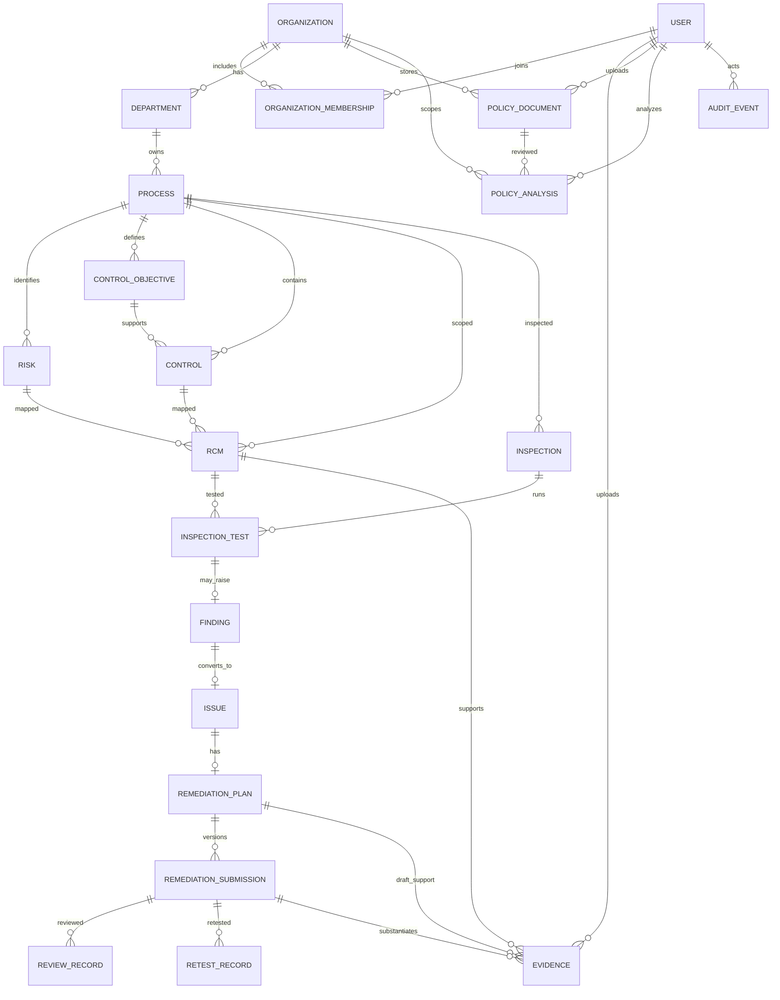

# ERD

每一条业务关系都受组织边界校验。同一 `organization_id` 应写入所有公司所属业务表；外键和唯一约束保证记录内一致，API 层在写入与读取时验证当前用户公司成员权限。每一轮 Submission 保存提交时的根因、行动计划和期限快照。Evidence 必须且只能关联 RCM、未提交整改计划、已提交 Submission 三者之一。

## 参考键

| 表 | 建议唯一键/检查 |
|---|---|
| organization_memberships | `(organization_id, user_id)` |
| departments | `(organization_id, code)` |
| processes | `(organization_id, code)` |
| risks | `(organization_id, code)` |
| controls | `(organization_id, code)` |
| rcms | `(organization_id, process_id, risk_id, control_id)` |
| findings | `inspection_test_id` |
| issues | `finding_id` |
| remediation_plans | `issue_id` |
| remediation_submissions | `(remediation_plan_id, version)` |
| evidences | `CHECK`：`rcm_id`、`remediation_plan_id`、`remediation_submission_id` 三列恰好一列非空 |

图中遗漏了所有记录到 Organization 的直接外键，以及 User 与负责人、执行人、创建人字段，以保持结构易读。

制度原件只在 MinIO 保存字节；`policy_documents` 只存元数据和随机对象键。`policy_analyses` 保存多次审阅的独立报告版本和验证后的法规引用，不保存提取出的制度全文。
