# ICMS / Contrlio 企业内控管理系统

> 以业务流程为主线，把风险、控制、检查证据与整改复核放进一条可追溯的管理链路。

## 项目定位

ICMS 面向企业内控、审计、财务和业务负责人，支持企业维护组织与流程，识别风险、设计控制措施、关联 RCM，记录检查执行与证据，并跟进问题整改、独立复核和重测。管理人员可从公司范围的实际记录查看风险和整改概况。

系统承担内控工作的设计、记录、监督与跟踪，不替代 ERP、POS、支付、HR 或审批执行系统；流程配置的发布也不会自动启动审批任务、通知或运行时工作流。

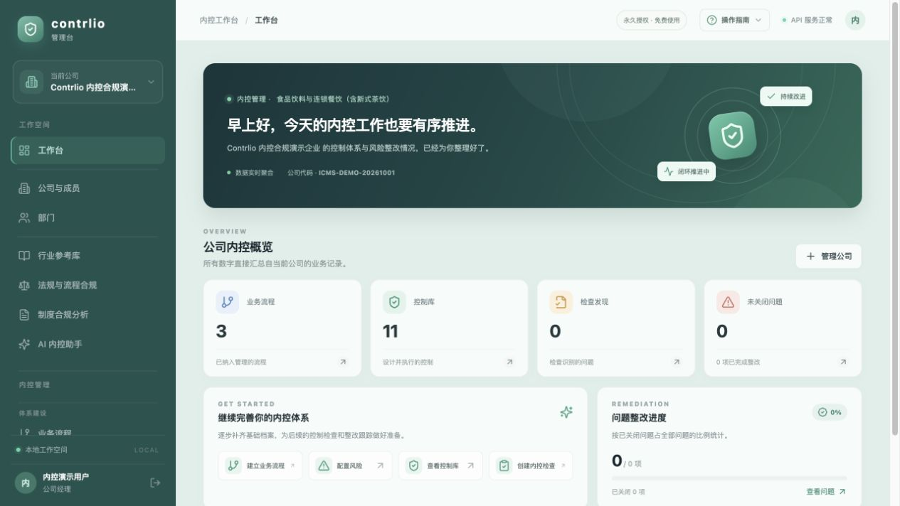

*工作台截图来自本地演示公司。图中的组织名称、指标和记录均为演示数据，不代表真实客户或生产业绩。*

## 菜单与业务职责

| 导航分区 | 菜单 | 解决的问题 |
|---|---|---|
| 工作空间 | 工作台 | 汇总当前公司的流程、控制、检查发现与整改记录。 |
| 工作空间 | 公司与成员、部门 | 维护租户、公司成员、角色和组织结构；业务访问由服务端 membership 与 RBAC 校验。 |
| 工作空间 | 行业参考库 | 浏览行业组织职责、流程/风险/控制参考、制度范本、实施方案与案例；参考模板需要企业按实际情况校准。 |
| 工作空间 | 法规与流程合规 | 按行业、国家或地区浏览法规索引及流程关注点，并与公司的实际流程对照。索引不等于实时法规抓取或法律意见。 |
| 工作空间 | 制度合规分析 | 管理公司制度原件，开展单份 AI 审阅或制度与流程交叉分析；正文发送到公司配置的外部模型前逐次确认。 |
| 工作空间 | AI 内控助手 | 围绕公司现有流程与检查整改记录生成建议草案；AI 可选，输出需由人员复核，不自动改写业务台账。 |
| 体系建设 | 业务流程 | 维护流程目的、范围、责任、表单及步骤，保存草稿、校验结果和发布快照。 |
| 体系建设 | 风险库、控制库、风险控制矩阵 | 管理固有/剩余风险、控制目标与措施，并把流程、风险、控制和检查程序建立关联。 |
| 监督整改 | 内控检查 | 建立检查和检查项，记录期间、测试程序、样本说明、执行人与结论。系统不会自动取得业务总体或替检查人员抽样。 |
| 监督整改 | 证据库 | 管理实际上传的检查/整改材料。文件字节存于 MinIO，PostgreSQL 保存元数据、SHA-256 和业务关联。 |
| 监督整改 | 整改闭环 | 将发现或风险事项分配给责任人，保存整改版本、证据、复核、重测和关闭记录。 |
| 分析管理 | 内控报告 | 从真实业务 API 记录汇总风险、控制、检查和整改情况；前端生成 Word 或通过浏览器打印 PDF。 |
| 系统 | 用户管理、账号设置 | 管理账号、公司 AI 服务设置、额度及个人偏好。具体操作受角色权限限制。 |

## 系统架构

### 应用与数据层

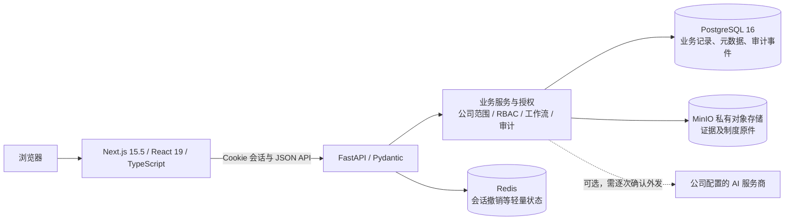

- **Web**：Next.js App Router、React 和 TypeScript 提供中文管理页面，调用真实 API。
- **API**：FastAPI、Pydantic、SQLAlchemy 2 与 Alembic 提供身份、公司范围授权、业务校验和数据库迁移。
- **身份与租户**：Argon2 密码哈希、短期 JWT、HttpOnly Cookie；每个业务请求按公司 membership/RBAC 校验。关联记录也要验证公司与流程归属。
- **业务事实**：PostgreSQL 保存组织、流程、风险、控制、检查、整改与审计记录，是业务数据来源。
- **文件证据**：MinIO 私有 bucket 保存真实文件字节；数据库保存文件名、类型、大小、SHA-256、上传者和业务关联。下载重新检查访问权限。
- **会话状态**：Redis 保存会话撤销等轻量状态，不保存核心业务事实。
- **AI 边界**：AI 为可选能力；公司可配置服务商凭据，密钥加密保存。制度正文传给外部模型前，每次都需操作人员确认。AI 建议需要人工复核。

### 核心业务链

整改状态保留版本和处理历史。缺少当前整改证据、复核或重测未通过时，不能直接关闭。系统要求责任人不能复核本人提交；关闭也受角色与独立性规则约束。实际控制执行情况、检查结论与证据仍由企业人员根据真实业务产生。

## 架构如何支撑应用价值

| 管理痛点 | 系统支持 | 管理价值 |
|---|---|---|
| 流程、风险和制度分散在不同文件 | 将流程、控制目标、风险、控制措施与 RCM 关联 | 管理者可从流程回溯关键风险和控制责任，减少靠个人记忆拼接资料。 |
| 检查发现后没人持续跟进 | 发现转为整改事项，明确责任人、期限、措施和当前状态 | 让问题处理有负责人、有进度、有可核验的提交版本。 |
| 整改自报完成、缺少验证 | 独立复核、重测和关闭动作分开记录，失败可退回 | 结案依据包含检查后的证据和验证过程，便于复查。 |
| 证据难定位或无法确认文件对应哪项控制 | 真实文件存入 MinIO，记录哈希和业务关联并按权限下载 | 支持定位、完整性核对和后续抽查；不以模板或文件名代替真实执行材料。 |
| 从零搭制度和流程成本高 | 行业参考库提供可校准的流程、风险、控制和制度起点 | 缩短梳理准备时间；企业仍需校准适用性、职责和控制标准。 |
| 管理层缺少整体视图 | Dashboard 与报告从当前公司 API/数据库记录聚合 | 根据已录入的业务记录查看风险、检查和整改情况；数据质量仍取决于记录完整性。 |
| AI 使用缺乏数据边界 | AI 可选、公司级配置、逐次确认制度正文外发，保留分析来源与报告 | 可用于分析草稿和优化建议，同时由人员把关数据范围与最终判断。 |

## 企业实务演练案例

以下是按行业参考资料整理的**模拟实施情境**，用于说明系统如何支持管理闭环，不是 ICMS 客户的真实经营记录、检查结果或损失数据。

### 案例一：供应商准入与食材验收

演示流程页面以“供应商准入与食材验收”为例，覆盖供应商资格复核、采购订单、到货验收和批次追溯。企业可把以下工作纳入日常内控：

1. **说明流程与职责**：记录供应商准入、资质核验、采购、到货验收、批次/保质期检查和异常处理的岗位职责。
2. **连接风险与控制**：例如供应商资质失效、到货质量不合格、批次记录缺失等风险，对应复核资质、按标准验收、记录批次与温控等控制措施。
3. **设计检查程序**：内控检查人员按检查期间确定供应商/采购批次总体，核对订单、验收、温控与供应商资料。抽样范围和数量应依据真实总体、风险和企业制度另行确定。
4. **保存真实证据**：将供应商资料、订单、验收记录或温控资料上传到对应 RCM/整改记录，形成可回看的业务关联。
5. **发现后验证**：有异常时创建发现和整改事项，记录根因、责任人、期限与新证据，再经独立复核和重测决定是否关闭。

系统用于配置和留存这条管理链，不替代采购系统、供应商平台或现场质量检验。

### 案例二：门店退款与收银日结差异

行业参考库中的模拟情境设定为：POS 显示 18 笔退款，支付平台记录 15 笔原路退款，另有 3 笔未关联原订单；现金交班还存在尚未查明的短款。这个情境**不表示发生了舞弊或真实资金损失**，需要先核对原始记录和时间差。

在 ICMS 的业务路径中，企业可以先维护门店退款和日结流程，再把“无原订单退款”“退款未独立复核”“日结差异未查明”等风险与控制措施纳入 RCM。检查时将 POS 退款、支付平台流水和交班记录的完整总体对照，对异常交易做针对性检查，并把实际来源文件作为证据。

若证据支持存在流程缺口，可将发现转入整改，调整实际门店系统的退款权限、原订单关联要求和差异升级规则。ICMS 保存责任人提交的整改材料，由独立人员复核和重测；例如在后续 10 个营业日重新抽查对账执行。通过后才按规则关闭。**ICMS 当前不连接 POS 或支付平台自动对账，也不自动修改门店权限**；上述规则要由企业在相关业务系统与管理流程中落实。

## 网页系统截图

截图均来自本地“Contrlio 内控合规演示企业”工作空间，包含虚构演示记录，不含生产业务数据。截图于 **2026-10-02** 为系统介绍资料采集；后续页面更新可能尚未反映在截图中。空白列表或演示指标只说明当时演示环境的状态，不代表系统验收指标。

### 工作台与组织流程

工作台按公司范围聚合流程、控制、检查发现和整改情况。图中数值是演示数据。

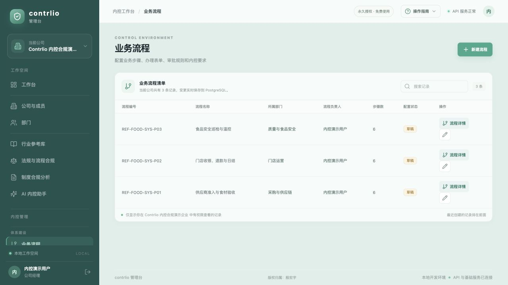

流程列表展示演示公司的流程编号、名称、部门、负责人、步骤和草稿/发布状态。

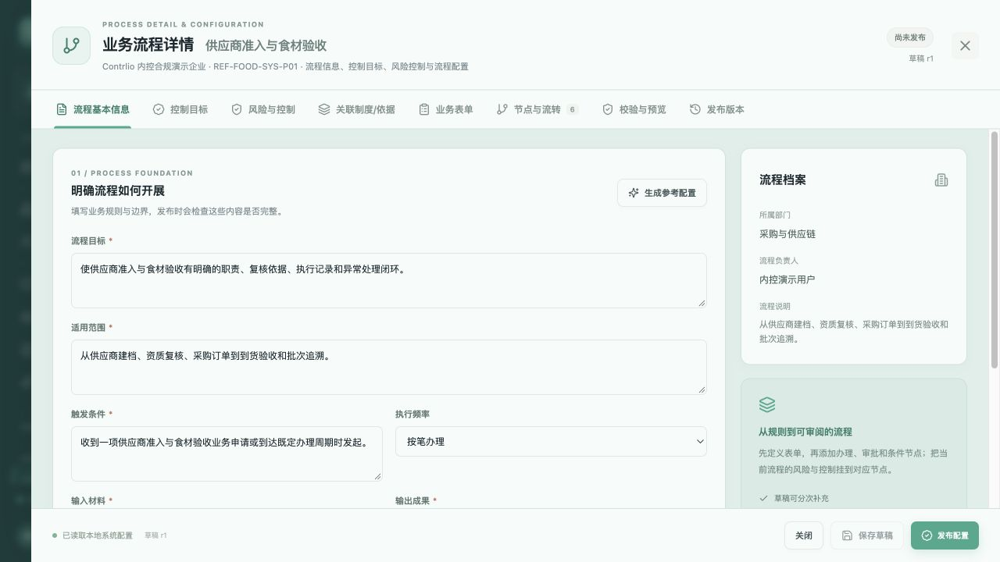

流程配置支持说明目标、适用范围、触发条件、输入输出及步骤流转，并保留草稿与发布版本。发布快照用于管理设计版本，不会自行启动实际审批。

### 风险、控制与 RCM

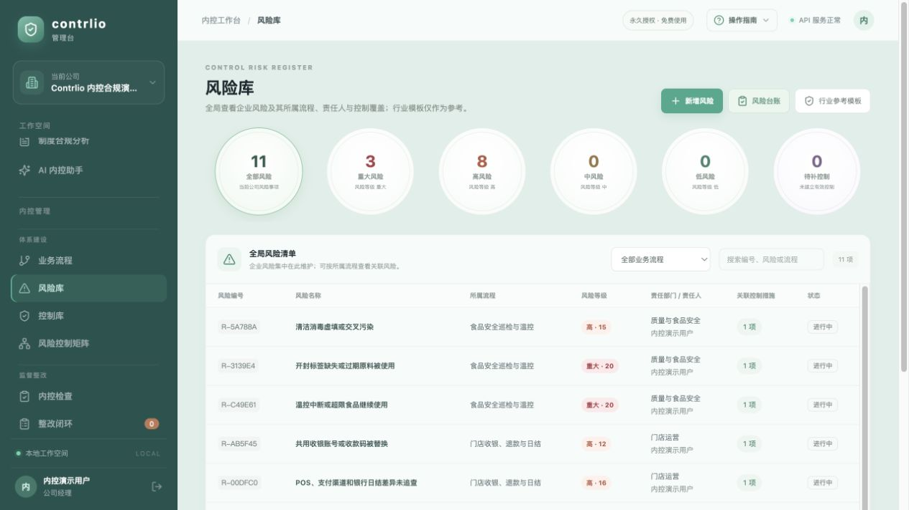

风险库示例按风险等级、关联流程、责任人与状态查看风险台账。

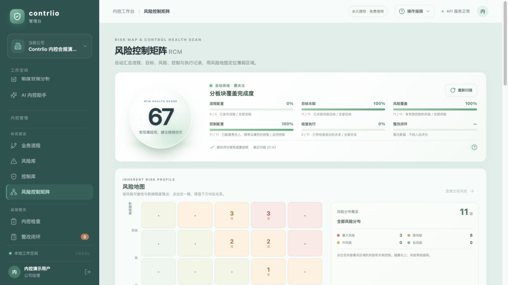

此图展示流程和风险控制矩阵的覆盖提示；数字来自演示环境，不能当作真实控制有效性评价。

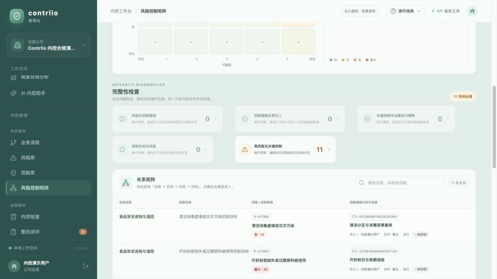

关系矩阵把流程、控制目标、风险及措施放在同一视图，帮助定位未关联或需优化的位置。

### 检查、证据与整改

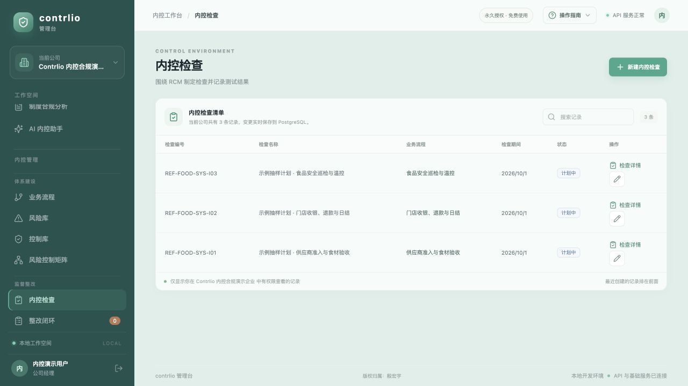

检查列表展示所检查流程、检查期间和当前状态。

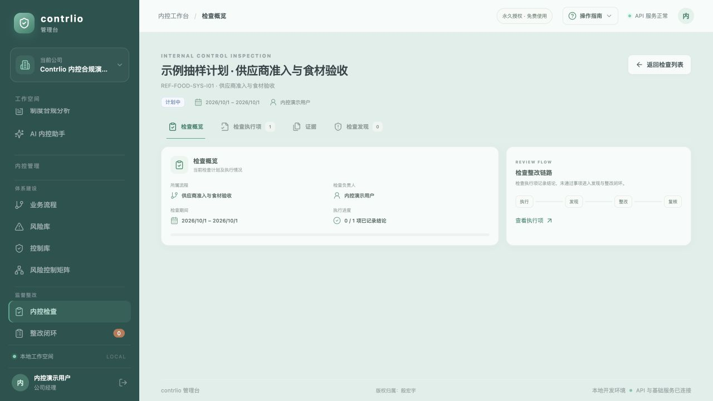

检查详情呈现执行进度，并提示检查发现进入整改的业务路径。

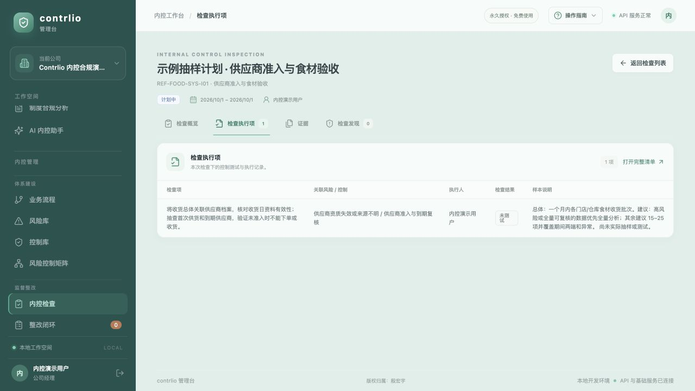

检查执行项用于记录程序、关联风险/控制、执行人、结论和样本说明。图中检查尚未记录结论，不应理解为通过。

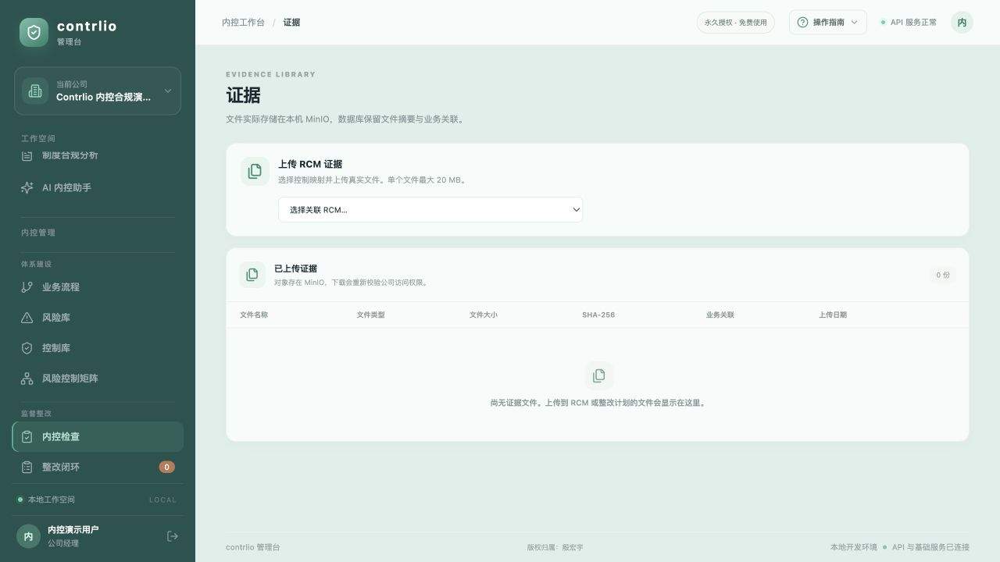

证据库截图采集时没有上传文件，因此列表为空。该图仅展示页面结构；2026-10-04 后续版本增加了文件行详情与业务关联悬停信息，这些新交互没有包含在本截图中。

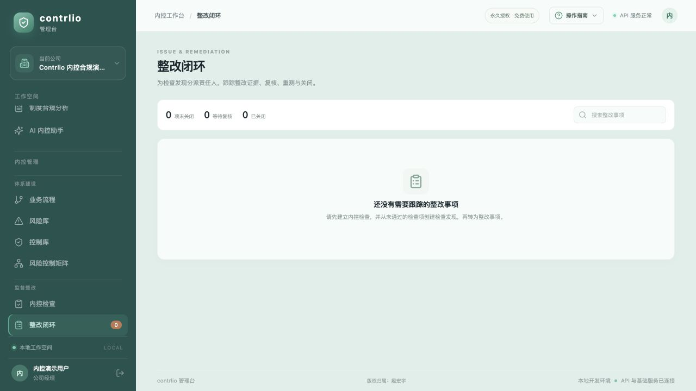

截图采集时没有待跟进整改项。实际流程由整改状态、证据版本、复核、重测和关闭记录组成；空列表不是整改闭环验收证据。

### 合规索引与报告

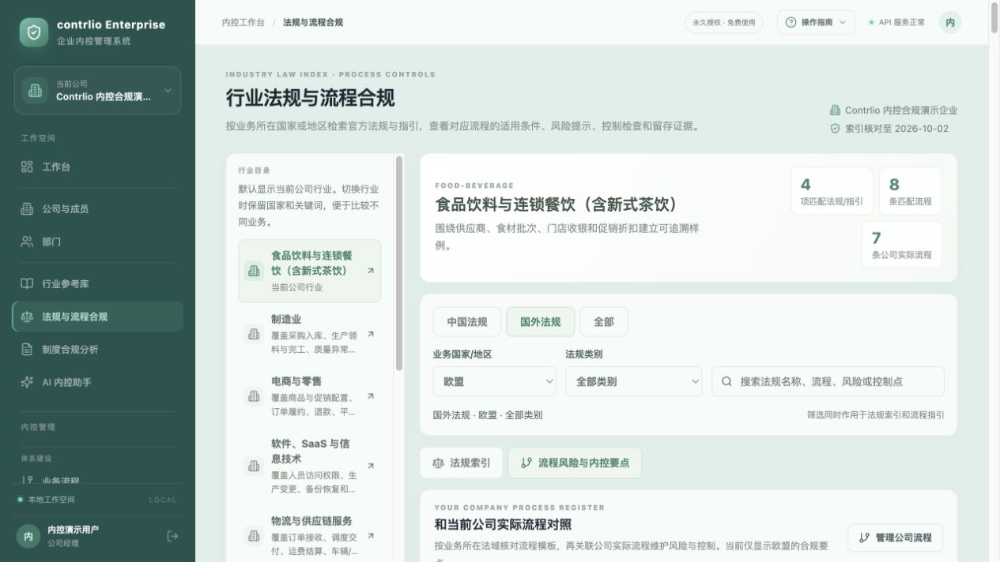

法规页面按行业和国家/地区筛选索引及流程关注点，并可对照公司流程。截图中的法规索引日期为 2026-10-02；上线使用前仍需由法务/内控人员核对官方来源及适用性。

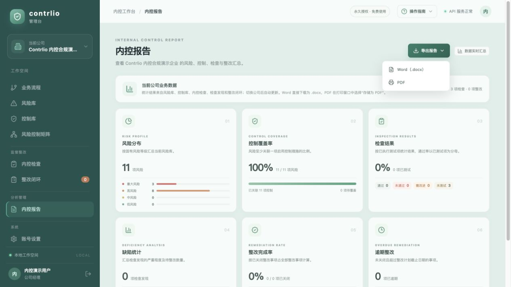

报告从公司实际 API 数据汇总风险分布、控制覆盖、检查结果和整改情况，可导出 Word 或打印为 PDF。截图中的统计值是演示数据。

## 技术栈与本地运行

| 组成 | 实现 |
|---|---|
| Web | Next.js 15.5、React 19、TypeScript 5.8 |
| API | Python 3.11+、FastAPI、Pydantic、SQLAlchemy 2、Alembic |
| 数据 | PostgreSQL 16、MinIO、Redis |
| 鉴权 | Argon2、JWT、HttpOnly Cookie、公司 membership 与 RBAC |
| 本地入口 | Web `http://localhost:3000`；API `http://localhost:8000`；Swagger `http://localhost:8000/docs` |

本地安装与启动步骤见 [icms/README.md](../README.md)。详细实现边界见 [项目上下文](PROJECT_CONTEXT.md)、[需求与边界](REQUIREMENTS.md)、[架构](ARCHITECTURE.md) 和 [任务状态](TASKS.md)。

## 实现与验收边界

- 本文描述的是源码和项目文档中可确认的能力，不等同于所有业务流程已在生产端到端验收。
- 流程配置是设计和版本发布能力，不是运行时工作流引擎。
- 模板是起点，不会生成实际控制执行记录、检查通过结果、整改或证据。
- 检查样本说明不是自动抽样平台；需要由企业核实总体并执行检查。
- 行业法规库是带来源的索引/流程指引，不是实时抓取、法律建议或现行有效性自动核验。
- AI 输出只是分析草案；制度全文外发前需逐次确认，使用者仍负责审阅。
- 报告依赖已录入的真实数据；空数据或不完整数据无法提供完整风险保证。
- 截图仅证明演示页面在采集时的呈现，不证明生产功能、真实客户成效或控制有效性。
