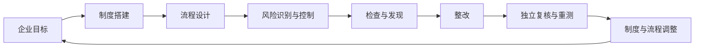

# 业务需求与实现边界

更新日期：2026-10-04。依据 README、[现有产品需求](PRODUCT_REQUIREMENTS.md)、领域模型和当前源码整理。下文区分业务目标、已有实现与待明确能力；不代表已完成整套运行验收。

## 产品要求

企业应能够把目标落实为制度和流程，识别影响目标的风险，设计并执行控制，保存真实证据，通过检查发现偏差、整改和独立验证，再把结论反馈到制度与流程调整。所有操作应有公司范围、责任人、状态和可追溯记录。

## COSO 内控闭环

此图是本项目的业务闭环要求。当前实现覆盖程度如下：

| 环节 | 当前可使用的模块/数据 | 当前边界与待补充事项 |
|---|---|---|
| 企业目标 | 公司/流程说明、流程下的 `ControlObjective` | 控制目标属于流程；未发现独立的企业战略/经营目标、目标分解或指标模型。目标到制度/流程的正式映射需确认。 |
| 制度搭建 | 行业示范制度、公司制度上传/下载、AI 分析、`ProcessPolicyLink` | 已支持原件管理与流程引用；未发现制度修订版本、审批发布、生效/废止的独立闭环。 |
| 流程设计 | 部门/流程档案、表单/任务/审批/条件配置、草稿、发布检查、版本历史 | 配置属于设计与发布；不会自动启动实际审批、待办、通知或超时执行。 |
| 风险识别与控制 | 风险评估、行业风险模板、控制目标、措施、RCM、流程/目标关联 | 模板是起点；固有/剩余风险、负责人和证据要求需按公司实际复核。 |
| 检查与整改 | Inspection/Test、Finding、Issue、责任人/根因/行动/期限、整改转派、证据与版本提交 | Issue 可来自检查发现或直接来自风险；检查结果和整改证据须由实际工作产生。 |
| 验证 | 独立复核、重测、关闭门槛、审计历史 | 对当前提交版本验证；不通过退回整改，保留历史。 |
| 制度调整 | 可人工根据发现/整改结论更新制度文件、流程配置、控制与风险评估 | 尚无整改关闭自动触发制度修订、影响分析、审批及回溯关联的完整机制。 |

制度与流程调整是闭环的一部分，不应仅以 Issue 关闭代替持续改进完成。新增企业目标与制度生命周期能力时，应先确定实体、关联关系、审批责任及验收标准，再写入决策和任务。

## 用户与权限

系统管理员维护系统账号与公司；公司经理维护本公司组织、流程、风险、控制和成员，分配整改并管理公司配置；内控审计员执行检查、记录发现、复核与重测；整改责任人处理本人任务并提交证据；只读角色查看授权范围。

公司 membership 是服务端授权依据。列表、详情、写入和文件下载均须验证组织范围；不能仅依靠页面隐藏按钮或对象 UUID。

## 核心功能需求

| 范围 | 要求 |
|---|---|
| 公司建档 | 支持公司注册/创建、启用与可恢复停用、部门、成员与角色管理。新账号自助注册必须提供系统管理员签发的有效邀请码；邀请码一次性使用。系统管理员可再次查看仍有效的邀请码。既有账号保留原有登录和公司数据，不受注册门槛影响。 |
| 行业参考 | 提供通用及行业组织、流程、风险控制、RACI、制度和实施参考；预览与实际应用区分，重复应用保护，来源与适用边界可见。 |
| 流程与矩阵 | 流程、风险、控制目标、措施、RCM 保存实际关联，校验公司与流程一致；流程配置保留发布快照。 |
| 风险管理 | 保存固有/剩余风险及核查、抽样、证据建议；支持归档并保留历史关联；支持从风险发起整改。 |
| 证据 | 文件实际保存到 MinIO，数据库记录元数据和 SHA-256；上传/下载校验权限；证据关联到 RCM 或整改版本。证据库列表中的长业务关联可悬停查看全文；点击每行可查看文件名、业务关联、类型、大小、SHA-256 和上传日期。 |
| 内控检查 | 检查及检查项关联 RCM，保存测试程序、样本说明、执行人、结果；异常形成 Finding。 |
| 整改闭环 | 来源唯一，责任人有效，行动与期限明确；提交有证据和版本；冻结提交资料，独立复核与重测通过后关闭。 |
| 汇总与报告 | Dashboard 从组织范围业务记录聚合；内控报告读取实际 API 数据，前端导出 Word/打印 PDF。 |
| 制度与法规 | 以公司制度库统一管理原件；选择单份制度，使用公司设置中的当前 AI 服务商/模型审阅并查看历史；选择多份制度及业务流程开展交叉分析，重点发现制度间、制度与流程间、流程间冲突和执行断点并给出优化建议。报告记录来源与流程版本，正文外发逐次确认，AI 输出供人工复核。 |
| AI 与账户 | AI 可选，公司凭据加密，配额/用量可查；普通成员默认每人每自然月 2,000,000 tokens，系统管理员不限额，经理可调整普通成员额度；已有账户试用、付费/豁免和管理员管理代码，启用状态由环境配置决定。 |

## 整改验收规则

状态链：`open → in_progress → in_review → verified → retested → closed`。复核或重测失败返回 `in_progress`。

- Finding 转 Issue 唯一；风险直接发起的事项与 Finding 来源互斥。
- 一项 Issue 对应当前整改计划；责任人提交前需有实际整改证据，提交形成递增版本与计划快照。
- 复核人、重测人不能是当前责任人或本轮提交人；当前实现允许复核人与重测人为同一人。
- 关闭需当前版本重测通过；关闭人不能是责任人或本轮重测人。是否进一步分离复核和重测职责列入待确认决策。
- 修改与转派受工作流状态约束，历史提交、复核、重测及审计记录不得覆盖。
- 分派或转派责任人前，须验证其为当前公司已启用成员，并确保其以外仍有至少两名可独立承担复核/重测/关闭的处理人；不满足时服务端拒绝分配，页面预先禁用并解释缺口。
- 整改详情应逐步显示当前阶段、下一处理阶段、适用角色、当前公司已启用的可处理同事及联系方式；系统需明确说明当前用户是否能处理以及被排除的独立性原因。责任人负责证据和提交，经理/系统管理员可建立计划或在整改中编辑/转派，经理/审计员/系统管理员按责任人、提交人、重测人的排除规则复核、重测和关闭。

## 非功能与验收边界

业务记录保存于 PostgreSQL，证据原件保存于 MinIO；页面调用真实 API。AI 未配置时核心业务仍可使用。制度 AI 分析前逐次确认正文外传；扫描 PDF OCR、法规实时抓取与自动法律有效性核验不属于现有能力。交叉分析只对用户明确选择的来源下结论，单次正文和流程配置输入合计最多 100,000 字符；保存来源文件哈希、流程版本和报告，不保存所提交的完整制度正文。

流程配置不等于运行时工作流引擎；检查项中的样本说明不等于完整自动抽样平台。Walkthrough、审计调查和完整测试优化沿用 [路线图](ROADMAP.md) 的后续范围，具体完成状态见 [任务](TASKS.md)。

整体验收需实际走通“建档 → 风险控制 → 证据 → 检查异常 → 事项 → 整改 → 复核 → 重测 → 关闭 → Dashboard/报告核对”，并验证跨公司拒绝、角色拒绝、无证据拒绝、版本冻结和失败退回。代码或测试文件存在不等于验收通过。
